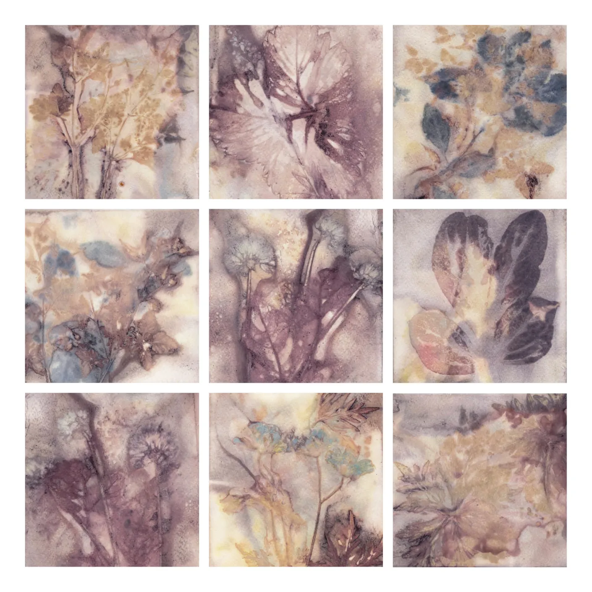
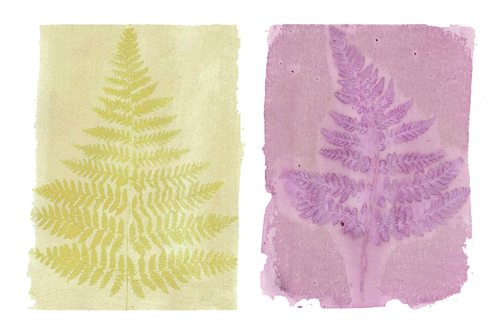
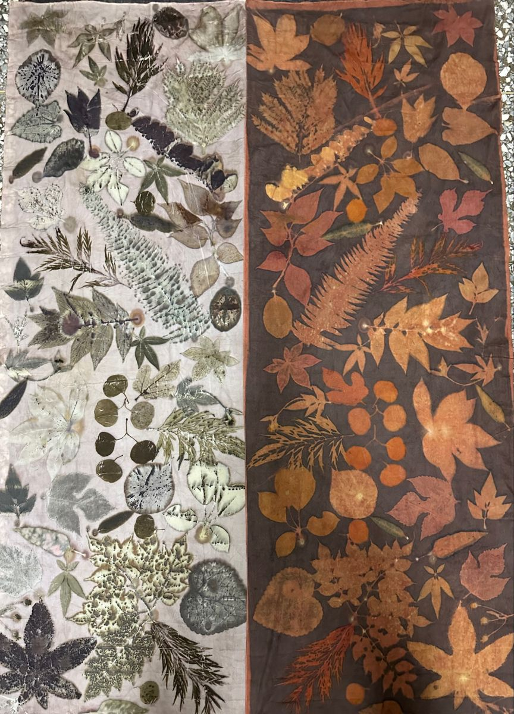

# Description

Ecoprint is a tool that helps digitally generating ecoprint and anthotype effects. It simulates the natural process of different plants falling across each season, allowing users to collect and collage them into decorative patterns. Each plant in the tool features a unique, randomly generated shape and color. Users can drag plants into the imprint area to stamp their shape and color onto the canvas. Like the real ecoprinting and anthotype process, the longer a plant contacts the surface, the deeper and more vibriant its imprint becomes. Users can also change the color of canvas, change seasons, rotate and delete a plant.

There are two major challenges when developing this tool. The first one is randomly generating plants. After searching for many plant genreation examples on the internet, I borrowed Richard Bourne's work (https://openprocessing.org/sketch/1681353) in drawing basic maple shapes from bezier curves. Then I modified this program to make it be able to generating different maple shapes from randomly assigned parameters. I also spend some time to make each plant having a same set of parameter configuration so that its shape wouldn't be messed up from falling, rotating and imprinting. Beside maples, I also created a flower class by changing how the parameters control the bezier curves. Each plant's color gradient is created by randomly shuffling the color palette and selecting the first two colors.

The other challenge is to realize the imprint function. I asked chatGPT and copilot for this function. To create imprints, the tool generates an offscreen canvas (createGraphics()) each time a plant is stamped. The plant is drawn on this hidden canvas and its image is applied to the main canvas. The longer a plant stays in the printing area, the more layers accumulate. These images can be scaled, rotated and multiplied to create watercolor-like imprint effects.

ChatGPT and copilot is also used for getting suggestions and debugging other functions in this program.

# Inspiration

This project draws inspiration from traditional botanical printing methods such as ecoprinting and anthotype photography. Ecoprinting captures plant forms and colors directly onto fabric through heat and pressure, while anthotype uses photosensitive plant extracts to create sun-developed images. Here are some examples created by photographor Jo Stephen: https://jostephen.photography/cyanotype/

Another ecoprint example from pinterest.

I was fascinated by the organic impressions plants create on fabric and canvas, and I appreciate how these methods preserving natural materials' unpredictability and making space for intentional artistic expression.

From these pictures, I extracted three feasible visual features to realize in the program:

1. A fine outline around the plants' edges

2. Watercolor-like diffusion and variation effect on the edges

3. Layered imprint effect from overlapping different plants

# Interaction

The user can choose one season to begin generating plants. Each season is associated with a catrgory of plant (for this version: Spring-flower, Summer & Fall-maple) and a color palette. Each plant's shape and color is generated randomly.

The generated plants will fall into the bottom of the canvas. There is a maximum of 15 plants exisiting in the canvas at the same time.

The user can click one plant to drag it onto the printing area. When the plant is detected not moving for a second, its imprint will be shown on the canvas. The longer a plant stays, the deeper and more vibriant its imprint becomes.

The user can press "+/-" to rotate a selected plant. Press "delete" and click the undesired plant to remove it.

# Future Development

Due to time limits, this program is still under development. First, the category of plants can be further enriched, for example adding boradleaves and pine in the summer and winter seasons. Second, the gradients can be smoother for the imprints. I haven't found a good way to solve it. Last but not the least, the imprint generating method can be improved. For now, each imprinted plant will generate a new hidden canvas, which will occupy a lot of browser memory. 